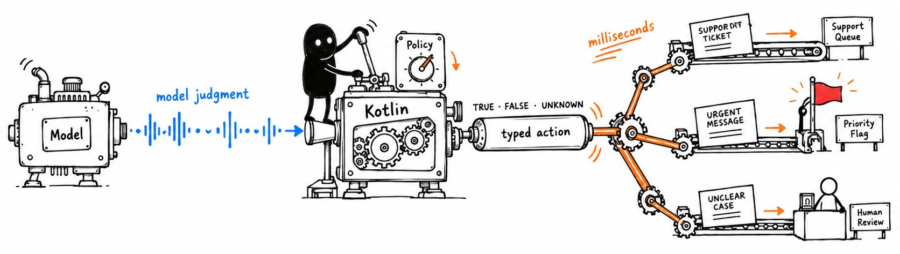

# Kleene

**The model judges. Your code decides.**



Kleene lets Kotlin code ask a Jev-like (non-autoregressive) model yes/no, pick-one and rating questions about text or JSON, and get
back typed answers that a `when` can branch on. If the model is not sure enough for your `Policy`, the
answer is UNKNOWN: a value you handle, for example by sending the case to a person. Never a hidden guess.

```kotlin
val ai = Kleene(SystemOneJudge.fromEnv())
val urgent by ai.feels("Needs a response today")

when (urgent(message).truth) {
    TRUE -> flag(message)
    FALSE -> queue(message)
    UNKNOWN -> humanReview(message)   // the Judge answered, but not clearly enough for your Policy
}
```

## Why Kleene

The usual way to put a model behind an `if` is to prompt a chat model for JSON such as
`{"answer": true, "confidence": 0.95}`, parse it, and keep the Boolean. That has three problems:

- **The confidence is self-reported.** The model wrote `0.95` the same way it writes any other text. It is not a measurement.
- **Doubt becomes `false`.** A Boolean has no room for "not sure", so borderline cases turn into a silent yes or no.
- **Failures look like answers.** A timeout or an unparsable reply often ends in a default value, and nobody notices.

Kleene fixes each one:

- **Probabilities from model scores.** A Judge is a decision model, such as TypeSafe's Jev or a local Kev. It
  returns a probability for each possible answer, never generated text. Kleene checks every number and keeps
  it exactly as received.
- **Three outcomes.** Your `Policy` sets how sure is sure enough. Below that, the answer is UNKNOWN, not a
  coin flip into yes or no.
- **Errors throw.** A timeout, a 5xx or a malformed response throws a `KleeneException`. It never becomes
  UNKNOWN, and UNKNOWN never becomes `false`.

And you get more than a branch:

- **Typed answers.** `choose` returns your own enum or class. `score` returns the whole distribution over your rubric.
- **Change the threshold, not the call.** Every `Verdict` keeps its `Evidence`, so you can try a stricter
  `Policy` with zero model calls.
- **Test what your software says.** `check` holds any output (a template, a translation, a generated reply)
  against a `Contract` of plain-language requirements and reports PASS, FAIL or UNKNOWN for each one.
- **Cloud or local.** The same code runs against TypeSafe's hosted API or a Kev judge on your machine. Three
  environment variables choose which.

The name comes from Stephen Kleene's three-valued logic. `Truth` follows its rules: `TRUE and UNKNOWN` is
UNKNOWN, `FALSE and UNKNOWN` is FALSE.

## Install

Kleene is not published to Maven Central yet. Build it and install it into your local Maven
repository (`~/.m2`) first. You need JDK 17 and Maven:

```sh
git clone https://github.com/keyboardsamurai/kleene.git
cd kleene
mvn -pl kleene -am install   # runs unit tests, installs kleene-parent and kleene
```

Then add the dependency to your project:

```xml
<dependency>
    <groupId>com.antonioagudo.libs</groupId>
    <artifactId>kleene</artifactId>
    <version>0.1.0-SNAPSHOT</version>
</dependency>
```

Gradle builds resolve it after you add `mavenLocal()` to `repositories`.

JDK 17, Kotlin 2.x. Runtime deps: `kotlinx-coroutines-core`, `kotlinx-serialization-json`.

## Usage

```kotlin
import kleene.*
import kleene.Truth.*

val ai = Kleene(SystemOneJudge.fromEnv())

val urgent by ai.feels("Needs a response today")
val route by ai.choose("Which team should handle this?",
    "billing" to Queue.Billing,
    "technical" to Queue.Technical,
    "other" to Queue.General,
)
val clarity by ai.score("How clearly is the problem described?", "Unclear", "Partly clear", "Clear")

val queue: Queue = route(message).orElse { Queue.Review }
when (urgent(message).truth) {
    TRUE -> Priority.Now; FALSE -> Priority.Normal; UNKNOWN -> Priority.Review
}
```

Each call is one request to the judge. To ask several questions in one request, use
`val answers = ai.ask(message, urgent, route, clarity)` and read `answers[urgent]`. A question takes its
name from the property. Renaming an option label creates a new question.

## Evidence and reapply

Every `Verdict` keeps the probabilities exactly as the judge returned them, so you can reapply a different policy
without another model call:

```kotlin
val verdict = route(message)
verdict.evidence.probabilityOf(Queue.Billing)   // also: top, margin, normalizedEntropy, judge, model
val strict = verdict.at(acceptAt = 0.95)         // same evidence, stricter policy, zero model calls
```

`acceptAt` and `margin` work the same for every judge. `confidence` is the provider's own metric and
you cannot compare it across judges.

## Cloud or local judge

`SystemOneJudge` sends `POST {baseUrl}/v1/systemone`. `SystemOneJudge.fromEnv()` reads three variables:

| Variable | |
|---|---|
| `KLEENE_BASE_URL` | default `https://api.typesafe.ai` (TypeSafe) |
| `KLEENE_API_KEY` | optional; sent as `Authorization: Bearer` |
| `KLEENE_MODEL` | required, e.g. `jev-1.13.0` |

For a local [Kev](https://github.com/jaredpalmer/kev) judge, run `scripts/kev.sh` inside a Kev checkout
and set `KLEENE_BASE_URL=http://127.0.0.1:8009`. There is no fallback from a local URL to the cloud.

On Apple Silicon, `scripts/laya.sh` starts a [Laya](https://pypi.org/project/laya-mlx/) judge behind
[laya-server](https://github.com/phaser/laya-server). It needs `uv` but no checkout; the first start downloads about
680 MB of model files, plus Python 3.11 and the packages if uv has not cached them.
Set `KLEENE_BASE_URL=http://127.0.0.1:8010` and `KLEENE_MODEL=laya-mlx`. Laya is wire-compatible but untested
([ADR-0006](docs/adr/0006-laya-runs-behind-a-third-party-bridge.md)): its default multilingual checkpoint reads at
most 1024 tokens of state, instructions and options, drops the rest without an error, and is not calibrated. In
the demo it was wrong on most cells it decided ([demo/README.md](demo/README.md#laya)), so don't use it for `check`
without your own evaluation. Upstream Laya (PyTorch) gives the same answers, so this is the model, not the MLX port
([demo/kalah.md](demo/kalah.md#laya-mlx-port-against-upstream)). The two uvicorn warnings the server logs for each
request (`Unsupported upgrade request.` and `No supported WebSocket library detected`) are harmless: they come from
the HTTP/2 upgrade header that `java.net.http.HttpClient` sends.

## Check an output against a contract

```kotlin
val uploadError by contract {
    +"Says the upload failed"
    +"Makes clear that no files were saved"
    +"Tells the user to retry"
    rule("Fits the error banner") { it.length <= 180 }
}

val report = ai.check(bannerText, uploadError)
report.outcome        // FAIL if any result fails, else UNKNOWN if any is unknown, else PASS
report.assertPassed() // throws AssertionError with one row per result; says "inconclusive" on UNKNOWN
```

`check` runs every rule, then asks all requirements as `feels` questions in one request. It never
changes the output. `report.toJson()` gives the same results as JSON.

## Semantic tests with JUnit

Tag tests that call a real judge, and run them on demand:

```kotlin
@Tag("semantic")
class UploadErrorTest {
    private val ai = Kleene(SystemOneJudge.fromEnv())

    @Test
    fun `banner meets the contract`(): Unit = runBlocking {
        ai.check(renderUploadError(), uploadError).assertPassed()
    }
}
```

```sh
mvn test -Dgroups=semantic
```

To keep a tag out of the default `mvn test`, exclude it in surefire and drop the exclusion when
`-Dgroups` is given. This repo's parent `pom.xml` does that for `live` with a property-activated profile.

For unit tests without a model, use `ScriptedJudge`. It answers by question name and records every
request in `requests`:

```kotlin
val judge = ScriptedJudge { feels("urgent", 0.93) }
```

## Build

```sh
mvn test                                                                          # unit tests; live excluded
KLEENE_BASE_URL=http://127.0.0.1:8009 KLEENE_MODEL=kev-4b mvn test -Dgroups=live # live smoke tests
KLEENE_BASE_URL=http://127.0.0.1:8010 KLEENE_MODEL=laya-mlx mvn test -Dgroups=live # same, against Laya
```

## Errors vs UNKNOWN

UNKNOWN means the judge answered but not clearly enough for your `Policy`: handle it with `when` or `orElse`.
Failures throw `KleeneException` (`Authentication`, `InvalidRequest`, `RateLimited`, `Overloaded`,
`Unavailable`, `Timeout`, `Malformed`, `Unsupported`) and never become UNKNOWN. Cancellation propagates.

## Demos

Runnable demo programs live in the `demo` module (never published; see
[`docs/adr/0005-demos-live-in-a-separate-module.md`](docs/adr/0005-demos-live-in-a-separate-module.md)).
The first demo, `kleene.demo.promises`, checks a `Contract` of user promises over every git
version of a real terms-of-service document and reapplies the accept threshold at zero model
calls. See [`demo/README.md`](demo/README.md).
The second demo, `kleene.demo.kalah`, scores judges against each other on Kalah positions, with an engine as
the truth for every question. See [`demo/kalah.md`](demo/kalah.md).

## Inspiration

Kleene is inspired by [Probably](https://probably-lang.southpolesteve.workers.dev/)
([source](https://github.com/southpolesteve/probably)) by [Steve Faulkner](https://github.com/southpolesteve),
a small programming language for LLM workflows powered by Jev. Probably showed judgments as ordinary control
flow: `feels`, `match` and an explicit "maybe" branch. Kleene carries that programming model into plain Kotlin:
`feels`, `choose` and UNKNOWN. Thank you, Steve.

## License

MIT. See `LICENSE`.
