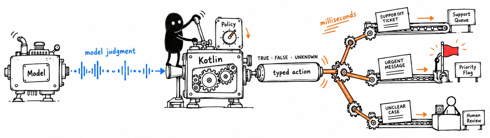

# Kleene

**Type-safe LLM decisions for Kotlin.**

Most LLM classification code eventually becomes `if (modelSaysYes) ...`.
But what happens when the model isn't sure?

Kleene gives you **TRUE**, **FALSE**, and **UNKNOWN** — three outcomes your code must handle:

```kotlin
val urgent by ai.feels("Needs a response today")

when (urgent(message).truth) {
    TRUE -> flag(message)
    FALSE -> queue(message)
    UNKNOWN -> humanReview(message)
}
```

**The model judges. Your code decides.**

You set how much evidence is enough to act. UNKNOWN means the answer did not meet that bar;
it is a value you can route to human review. Timeouts and malformed responses throw errors.

## Try it in 30 seconds - no API key

`ScriptedJudge` supplies fixed probabilities so you can try all three outcomes without a model,
an account, or a server. This complete example uses the same `feels` and `when` as your application:

```kotlin
import kleene.*
import kleene.Truth.*
import kotlinx.coroutines.runBlocking

fun main() = runBlocking {
    for (p in listOf(0.95, 0.05, 0.55)) {
        val ai = Kleene(ScriptedJudge { feels("urgent", p) })
        val urgent by ai.feels("Needs a response today")

        when (urgent("Can you look at this?").truth) {
            TRUE -> println("TRUE -> flag")
            FALSE -> println("FALSE -> queue")
            UNKNOWN -> println("UNKNOWN -> human review")
        }
    }
}
```

With the default thresholds, `0.95` becomes TRUE, `0.05` becomes FALSE, and `0.55` becomes UNKNOWN.
The probabilities here are scripted: changing the message does not change the answer.

Run the [example](demo/src/main/kotlin/kleene/demo/quickstart/Main.kt) with JDK 17 and Maven:

```sh
git clone https://github.com/keyboardsamurai/kleene.git
cd kleene
mvn -q -DskipTests install
mvn -q -pl demo exec:java -Dexec.mainClass=kleene.demo.quickstart.MainKt
```

The first build downloads dependencies and may take longer than 30 seconds. The example itself
makes no network calls and prints:

```text
TRUE -> flag
FALSE -> queue
UNKNOWN -> human review
```

Ready to use it in your project? [Install from Maven Central](#install), then
[connect a real Judge](docs/guide/01-getting-started.md).
For repeatable tests with recorded answers, use [ReplayJudge](docs/guide/07-testing.md).



## Highlights

### Route to your own enum, send doubt to a person in one line

```kotlin
enum class Queue(val label: String) { BILLING("billing"), TECH("technical support"), SALES("sales") }

val route by ai.choose<Queue>("Which team should handle this ticket?") { it.label }

suspend fun dispatch(ticket: String) {
    val queue = route(ticket).orElse { return humanReview(ticket, it.reason) }   // "top p=0.62 < acceptAt=0.85"
    send(ticket, queue)
}
```

The options are your enum constants, so a `when` over `queue` must handle every team. `orElse` is `inline`,
which lets `return` leave `dispatch` early.

### Three questions, one model call. Change the threshold later for free

```kotlin
val answers = ai.ask(ticket, listOf(route, urgent, angry))   // one Judge call for all three

answers[angry].truth            // UNKNOWN: p(true)=0.55 is inside the default band
answers[angry].at(0.51).truth   // TRUE: the same answer under a looser Policy, zero model calls

Evidence.feels(storedP, "jev", "jev-1.13.0").decide(Policy(acceptAt = 0.95))   // replay a p(true) from your DB
```

Kleene keeps the probabilities, so you can reapply a different Policy next week without paying again.

### Check a model's reply the way you check code

```kotlin
val uploadError by contract {
    rule("under 300 chars") { it.length <= 300 }
    +"Says the upload failed"
    +"Tells the user to retry"
    +"Does not blame the user"
}

println(ai.check(reply, uploadError, source = ticket))
```

```
contract "uploadError": FAIL (judge scripted, model scripted)
  PASS     under 300 chars
  PASS     Says the upload failed   p(true)=0.97
  FAIL     Tells the user to retry  p(true)=0.05
  UNKNOWN  Does not blame the user  p(true)=0.6
```

Rules run in plain Kotlin. All the requirements go to the Judge in one ask. `report.assertPassed()` turns the
check into a test assertion, and `report.toJson()` gives your CI a file to keep.

### Record real answers once, replay them in every build

```kotlin
// Once, against the real Judge: each ask is appended to the file.
val ai = Kleene(SystemOneJudge.fromEnv().recordingTo(Path("src/test/resources/tickets.jsonl")))

// Every build after that: the same answers, with no network and no API key.
val ai = Kleene(ReplayJudge(Path("src/test/resources/tickets.jsonl")))
```

Replay is strict. If you change a question or an input, it throws `IllegalStateException`. It never falls through
to a live model, and it never makes up an answer.

Not sure which `acceptAt` to use? Measure it on your own labeled data with
[Sweep](docs/guide/08-picking-a-policy-with-sweep.md).

## Why Kleene

The usual way to put a model behind an `if` is to prompt a chat model for `{"answer": true, "confidence": 0.95}`
and keep the Boolean. The confidence is self-reported text, doubt turns into `false`, and a failed call often turns
into a default value. Kleene keeps the model's probabilities, keeps doubt as UNKNOWN, and keeps failures as
exceptions. It also gives you:

- `choose` with your own enum or class, and `score` with the whole distribution over your rubric.
- A stricter or looser Policy on existing answers, with zero model calls.
- `check`: test any output against plain-language requirements, with PASS, FAIL or UNKNOWN for each one.
- The same code against TypeSafe's cloud or a local Judge, chosen by three environment variables.

The name comes from Stephen Kleene's three-valued logic: `TRUE and UNKNOWN` is UNKNOWN, `FALSE and UNKNOWN` is FALSE.

## Install

Add the dependency from Maven Central (JDK 17, Kotlin 2.x):

```xml
<dependency>
    <groupId>com.antonioagudo.libs</groupId>
    <artifactId>kleene</artifactId>
    <version>0.2.0</version>
</dependency>
```

Runtime dependencies are Kotlin's standard library, `kotlinx-coroutines-core`, and
`kotlinx-serialization-json`.

Set `KLEENE_MODEL` (for example `jev-1.13.0`) and `KLEENE_API_KEY`, or point `KLEENE_BASE_URL` at a local Judge.

## Guide

Start with the [guide](docs/guide/README.md). It goes from the first judgment to advanced features:

1. [Getting started](docs/guide/01-getting-started.md): install, configure a Judge, first `feels` question
2. [Questions](docs/guide/02-questions.md): `feels`, `choose`, `score`, `Verdict`, `Rating`, `Truth`
3. [Asking several questions](docs/guide/03-asking-several-questions.md): one ask, one model call, `Answers`
4. [Policy and Evidence](docs/guide/04-policy-and-evidence.md): Policy values, UNKNOWN, reapply with zero model calls
5. [Judges](docs/guide/05-judges.md): cloud or local, timeouts, retries, errors
6. [Checking outputs](docs/guide/06-checking-outputs.md): `Contract`, `check`, `Report`
7. [Testing](docs/guide/07-testing.md): `ScriptedJudge`, record and replay
8. [Picking a Policy with Sweep](docs/guide/08-picking-a-policy-with-sweep.md): pick an `acceptAt` from labeled Evidence

## Reference

- [Specification](docs/spec.md): the normative API and semantics
- [Architecture decision records](docs/adr/README.md)
- [Glossary](CONTEXT.md)

## Build

```sh
mvn test                                                                          # unit tests; live excluded
KLEENE_BASE_URL=http://127.0.0.1:8009 KLEENE_MODEL=kev-4b mvn test -Dgroups=live # live smoke tests
```

Start a local Judge only with `scripts/kev.sh` or `scripts/laya.sh`, one at a time; see
[Run a local Judge safely](docs/guide/05-judges.md#run-a-local-judge-safely).

## Demos

The unpublished `demo` module ([ADR-0005](docs/adr/0005-demos-live-in-a-separate-module.md)) includes the [no-key quick start](demo/src/main/kotlin/kleene/demo/quickstart/Main.kt) and three larger programs:

- [Promise tests](demo/README.md): `check` a Contract of user promises over every git version of a real
  terms-of-service document, and reapply a Policy at zero model calls.
- [Kalah bench](demo/kalah.md): scores Judges against each other on Kalah positions, with an engine as the truth.
- [ICD bench](demo/icd.md): codes 100 synthetic multilingual clinical documents into ICD-10-CM categories and
  shows where UNKNOWN saves a wrong code.

## Inspiration

Kleene is inspired by [Probably](https://probably-lang.southpolesteve.workers.dev/)
([source](https://github.com/southpolesteve/probably)) by [Steve Faulkner](https://github.com/southpolesteve),
a small programming language for LLM workflows powered by Jev. Probably showed judgments as ordinary control
flow: `feels`, `match` and an explicit "maybe" branch. Kleene carries that programming model into plain Kotlin:
`feels`, `choose` and UNKNOWN. Thank you, Steve.

## License

MIT. See [LICENSE](LICENSE).
